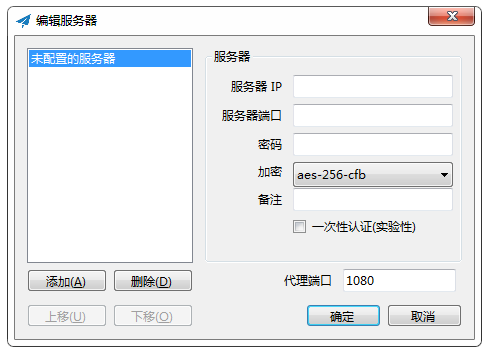
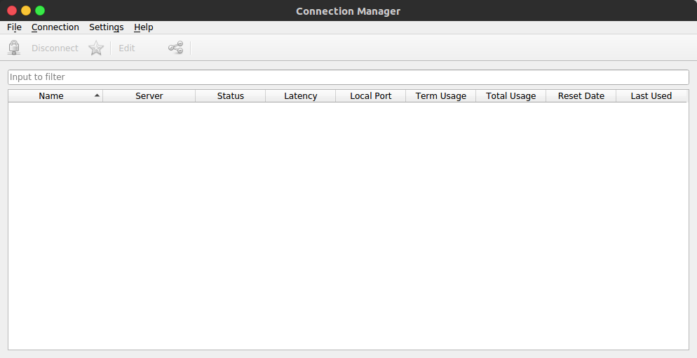
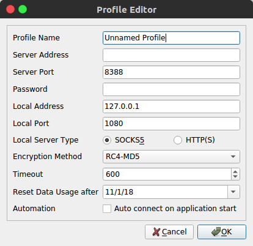

# Shadowsocks 使用

> 时间：2018年10月14日

---

## Windows 平台

#### 下载地址

```
https://github.com/shadowsocks/shadowsocks-windows/releases
```

新版本的 Shadowsocks 可能需要系统中有较高版本的 **.NET framework**，此时需要按照系统提示更新即可，也可以尝试下载较低版本的 Shadowsocks

#### 使用说明

- 下载 [Shadowsocks Windows 客户端](https://github.com/shadowsocks/shadowsocks-windows/releases/download/4.1.2/Shadowsocks-4.1.2.zip)，并启动（任务栏将出现一个纸飞机图标）

  

- 填写服务器信息，右键点击任务栏上的纸飞机图标，选择 **服务器** - **编辑服务器...**。一般需要填入的关键信息有 **服务器 IP** 、**服务器端口号**、**密码**、**加密**

  

- 右键点击任务栏上的纸飞机图标，勾选 **启动系统代理** （可以在 **服务器** 选项中选择启动哪一个服务器配置，可以在 **系统代理模式** 中选择 **PAC模式** 或者 **全局模式**）

## Linux 平台

> 主要针对 Ubuntu 16.04 发行版

#### 下载地址


```
https://github.com/shadowsocks/shadowsocks-qt5/releases
```

#### 使用说明

- 下载 [Shadowsocks Linux平台 GUI 客户端](https://github.com/shadowsocks/shadowsocks-qt5/releases/download/v3.0.0/Shadowsocks-Qt5-3.0.0-x86_64.AppImage)，并启动（系统界面右上角将出现一个圆型的绿色背景图标）

  

- 菜单栏选择 **Connection** - **Add** - **Manually**

  

- 填写服务器信息，一般需要填入的关键信息有 **Server Address** 、**Server Port**、**Password**、**Encryption Method**

  

- 点击确定后，在主窗口中右键点击刚才配置的服务器记录，选择 **Connect** 连接服务器

## Android 平台

#### 下载地址

选择一个合适版本进行下载

```
https://github.com/shadowsocks/shadowsocks-android/releases
```

#### 使用说明

方法同上

## Mac OS X 平台

#### 下载地址

选择一个合适版本进行下载

```
https://github.com/shadowsocks/ShadowsocksX-NG/releases
```

#### 使用说明

方法同上
